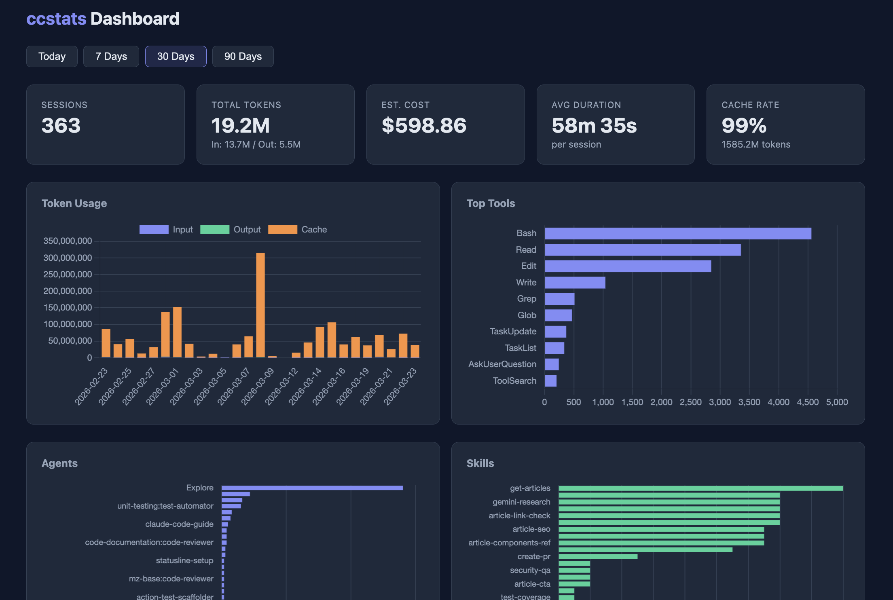

# ccstats

Claude Code の利用状況を集計・可視化するアプリケーション。

セッション終了時に Hook 経由でトークン使用量やツール呼び出しを収集し、Web ダッシュボードで確認できる。



## アーキテクチャ

```
Claude Code (ローカル)
    │  セッション終了時に Stop Hook 発火
    v
Hook Script (シェルスクリプト)
    │  transcript JSONL を解析 → 統計情報抽出
    │  CF Access サービストークン付きで POST
    v
Cloudflare Access (認証ゲートウェイ)
    │
    v
Cloudflare Workers (Hono)  ←── ブラウザ (ダッシュボード閲覧)
    │
    v
Cloudflare D1 (SQLite)
```

## 技術スタック

| コンポーネント | 技術 |
|--------------|------|
| ランタイム | Cloudflare Workers |
| フレームワーク | Hono (TypeScript) |
| データベース | Cloudflare D1 (SQLite) |
| 認証 | Cloudflare Access (サービストークン + ブラウザフロー) |
| ダッシュボード | SSR HTML + Chart.js (CDN) |
| バリデーション | Zod |
| テスト | Vitest (カバレッジ 95%+) |
| CI/CD | GitHub Actions → Cloudflare Workers |

## ディレクトリ構成

```
ccstats/
├── .github/
│   └── workflows/
│       └── deploy.yml           # CI/CD (テスト → デプロイ)
├── src/
│   ├── index.ts                 # エントリポイント (Hono + secureHeaders + CORS)
│   ├── routes/
│   │   ├── sessions.ts          # POST/GET /api/sessions
│   │   ├── stats.ts             # GET /api/stats/*
│   │   └── dashboard.ts         # GET / (ダッシュボード)
│   ├── repositories/
│   │   ├── session.ts           # sessions テーブルクエリ
│   │   └── stats.ts             # 集計クエリ
│   ├── templates/
│   │   └── dashboard.ts         # ダッシュボード HTML テンプレート
│   ├── types/
│   │   ├── api.ts               # Zod スキーマ + API 型定義
│   │   └── db.ts                # DB 行型定義
│   ├── lib/
│   │   ├── constants.ts         # 定数 (コスト単価等)
│   │   └── utils.ts             # ユーティリティ
│   ├── db/
│   │   └── schema.sql           # D1 スキーマ
│   └── __tests__/               # テスト (76件)
├── scripts/
│   └── hook.sh                  # Claude Code Stop Hook スクリプト
├── wrangler.example.toml        # Wrangler 設定テンプレート
├── package.json
├── tsconfig.json
└── vitest.config.ts
```

## DB スキーマ

### sessions

| カラム | 型 | 説明 |
|-------|-----|------|
| id | TEXT (PK) | ULID |
| session_id | TEXT (UNIQUE) | Claude Code の sessionId |
| cwd | TEXT | 作業ディレクトリ |
| git_branch | TEXT | Git ブランチ名 |
| claude_version | TEXT | Claude Code バージョン |
| model | TEXT | 使用モデル名 |
| input_tokens | INTEGER | 入力トークン合計 |
| output_tokens | INTEGER | 出力トークン合計 |
| cache_read_tokens | INTEGER | キャッシュ読み取りトークン |
| duration_seconds | INTEGER | セッション時間（秒） |
| started_at | TEXT | 開始時刻 (ISO 8601) |
| ended_at | TEXT | 終了時刻 (ISO 8601) |
| created_at | TEXT | レコード作成時刻 |

### tool_calls

| カラム | 型 | 説明 |
|-------|-----|------|
| id | INTEGER (PK) | 自動採番 |
| session_id | TEXT (FK) | sessions.session_id |
| tool_name | TEXT | ツール名 (下記参照) |
| call_count | INTEGER | 呼び出し回数 |

#### tool_name の命名規則

| カテゴリ | 形式 | 例 |
|---------|------|-----|
| 基本ツール | そのまま | `Read`, `Edit`, `Bash`, `Write`, `Glob` |
| Agent | `Agent:<type>` | `Agent:Explore`, `Agent:security-reviewer` |
| Skill | `Skill:<name>` | `Skill:commit`, `Skill:security-qa` |
| MCP | `mcp__<server>__<method>` | `mcp__serena__find_symbol`, `mcp__github__create_pull_request` |

## API エンドポイント

| メソッド | パス | 説明 |
|---------|------|------|
| `POST` | `/api/sessions` | セッションデータ登録 (Hook から呼び出し) |
| `GET` | `/api/sessions` | セッション一覧取得 |
| `GET` | `/api/sessions/:id` | セッション詳細取得 |
| `GET` | `/api/stats/summary` | 集計サマリー |
| `GET` | `/api/stats/tokens` | トークン使用量の時系列データ |
| `GET` | `/api/stats/tools` | ツール別呼び出し統計 |
| `GET` | `/` | ダッシュボード |

### POST /api/sessions リクエスト例

```json
{
  "session_id": "7e33bf2d-6da2-4d7d-83de-921b3ff3ad8c",
  "cwd": "/Users/user/project",
  "git_branch": "main",
  "claude_version": "2.1.2",
  "model": "claude-opus-4-6",
  "input_tokens": 15000,
  "output_tokens": 3000,
  "cache_read_tokens": 7000,
  "duration_seconds": 1200,
  "started_at": "2026-03-23T10:00:00Z",
  "ended_at": "2026-03-23T10:20:00Z",
  "tool_calls": [
    { "tool_name": "Read", "call_count": 15 },
    { "tool_name": "Agent:Explore", "call_count": 2 },
    { "tool_name": "Skill:commit", "call_count": 1 },
    { "tool_name": "mcp__serena__find_symbol", "call_count": 5 }
  ]
}
```

## ダッシュボード

### 概要カード

- 総セッション数
- 総トークン使用量 (input + output)
- 総コスト概算
- 平均セッション時間
- キャッシュヒット率

### グラフ

- **Token Usage** — トークン使用量推移（積み上げ棒グラフ: input / output / cache）
- **Top Tools** — 基本ツール利用分布（横棒グラフ: Read, Edit, Bash 等）
- **Agents** — Agent 呼び出し分布（横棒グラフ: Explore, Plan 等）
- **Skills** — Skill 呼び出し分布（横棒グラフ: commit, security-qa 等）
- **MCP Tools** — MCP ツール呼び出し分布（横棒グラフ: serena, github 等）

### フィルター

- 期間: Today / 7 Days / 30 Days / 90 Days

### 直近セッション一覧

日時、プロジェクト、ブランチ、モデル、トークン数、コスト概算、セッション時間を表示。

## 認証

Cloudflare Access で全エンドポイントを保護する。アプリケーション内に認証ロジックはなく、CF Access が前段で処理する。

| 用途 | 方式 |
|------|------|
| Hook → API | CF Access サービストークン (`CF-Access-Client-Id` / `CF-Access-Client-Secret`) |
| ブラウザ → ダッシュボード | CF Access ブラウザフロー (OTP / OAuth) |

## セットアップ

### 前提条件

- Node.js 22+
- Cloudflare アカウント
- wrangler CLI (`npm install -g wrangler`)

### 1. リポジトリのクローンと依存インストール

```bash
git clone git@github.com:mizunomi32/ccstats.git
cd ccstats
npm install
```

### 2. Wrangler 設定

```bash
cp wrangler.example.toml wrangler.toml
# wrangler.toml の account_id と database_id を自分の値に書き換える
```

### 3. D1 データベース作成

```bash
wrangler login
npx wrangler d1 create ccstats-db
# 出力された database_id を wrangler.toml に設定

npx wrangler d1 execute ccstats-db --remote --file=src/db/schema.sql
```

### 4. ローカル開発

```bash
npm run db:migrate:local
npm run dev
```

### 5. デプロイ

```bash
npm run deploy
```

### 6. Cloudflare Access 設定

1. Cloudflare Zero Trust ダッシュボードで Application を作成
2. ドメインに Workers の URL を設定
3. サービストークンを作成（Hook 用 M2M 認証）
4. ポリシーを設定:
   - Service Auth: Hook スクリプト用
   - Email: ダッシュボード閲覧用

### 7. GitHub Actions (CI/CD)

main ブランチへの Push で自動テスト → デプロイが実行される。

以下のシークレットをリポジトリの Settings → Secrets に登録:

| シークレット名 | 説明 |
|---------------|------|
| `CLOUDFLARE_API_TOKEN` | Cloudflare API トークン (Edit Workers 権限) |
| `CLOUDFLARE_ACCOUNT_ID` | Cloudflare アカウント ID |
| `D1_DATABASE_ID` | D1 データベース ID |

## Claude Code Hook 設定

### 1. `~/.claude/settings.json` に環境変数と Hook を追加

```json
{
  "env": {
    "CCSTATS_URL": "https://<your-workers-url>/api/sessions",
    "CF_ACCESS_CLIENT_ID": "<your-service-token-client-id>",
    "CF_ACCESS_CLIENT_SECRET": "<your-service-token-client-secret>"
  },
  "hooks": {
    "Stop": [
      {
        "hooks": [
          {
            "type": "command",
            "command": "/path/to/ccstats/scripts/hook.sh",
            "timeout": 30
          }
        ]
      }
    ]
  }
}
```

`CF_ACCESS_CLIENT_ID` / `CF_ACCESS_CLIENT_SECRET` は省略可能（CF Access 未設定時）。

### 2. Hook スクリプトに実行権限を付与

```bash
chmod +x /path/to/ccstats/scripts/hook.sh
```

### Hook の動作

1. セッション終了時に Stop Hook が発火
2. stdin から `session_id`, `transcript_path`, `cwd` を受け取る
3. `transcript_path` の JSONL を解析し、トークン使用量・ツール呼び出しを集計
4. Agent は `Agent:<subagent_type>`、Skill は `Skill:<name>` に展開
5. CF Access サービストークン付き（設定時）で `POST /api/sessions` に送信
6. 送信失敗時は `~/.ccstats-failed.jsonl` にフォールバック保存

## 開発

```bash
npm test              # テスト実行
npm run test:coverage # カバレッジ付きテスト
npm run typecheck     # 型チェック
npm run dev           # ローカル開発サーバー
```

## 設計詳細

詳細な設計ドキュメントは [docs/architecture.md](docs/architecture.md) を参照。
